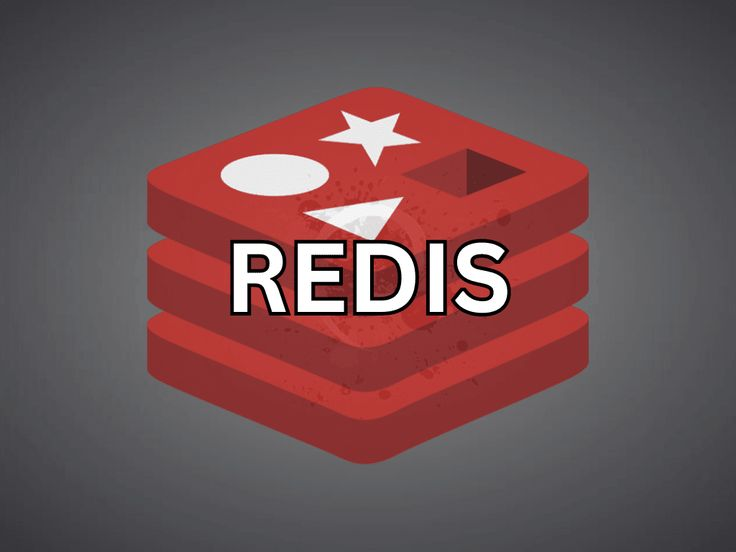

# Caching Technology and System README

## Introduction to Caching

Caching is a crucial technique in computer science and system design that involves storing frequently accessed data in a fast and easily retrievable location. This improves data access times, reduces latency, and enhances overall system performance. Caching is employed at various levels in a technology stack, from hardware to software.

## Caching Technology

### In-Memory Caching

In-memory caching involves storing data in the system's main memory (RAM) for faster access compared to fetching data from slower storage devices.

#### Key Technologies:

- **Redis:**
  - A high-performance, open-source, in-memory data store.
  - Supports caching, real-time analytics, and message brokering.

- **Memcached:**
  - A distributed in-memory caching system.
  - Simple key-value storage often used to alleviate database load.

## Caching Policies

Caching policies determine how and when data is stored, updated, and evicted from the cache. Choosing the right policy is crucial for optimizing performance.

### Common Caching Policies:

1. **Least Recently Used (LRU):**
   - Evicts the least recently accessed items first.
   - Simple and effective, but may not perform well in certain scenarios.

2. **First-In-First-Out (FIFO):**
   - Evicts the oldest items first.
   - Straightforward but may not represent actual access patterns well.

3. **Least Frequently Used (LFU):**
   - Evicts the least frequently accessed items first.
   - Considers access frequency, suitable for varying access patterns.

## Caching Algorithms

Caching algorithms determine how the cache manager selects items to keep or evict. Various algorithms cater to different use cases and access patterns.

### Common Caching Algorithms:

1. **Random Replacement:**
   - Selects a random item for eviction.
   - Simple but may not be optimal for certain scenarios.

2. **Clock (or Second-Chance):**
   - Similar to FIFO but uses a circular buffer.
   - Efficient and simple to implement.

3. **Adaptive Replacement Cache (ARC):**
   - Dynamically adjusts between LRU and LFU.
   - Adapts to changing access patterns for improved performance.

## Best Practices:

- **Cache Invalidation:**
  - Implement strategies to invalidate or refresh cached data to ensure accuracy.

- **Cache Warming:**
  - Preload frequently accessed data into the cache to minimize cache misses.

- **Monitoring and Metrics:**
  - Regularly monitor cache hit rates, evictions, and overall system performance.

## Conclusion:

Caching is a powerful technique for optimizing system performance by reducing data access times. Understanding caching technology, policies, and algorithms is crucial for designing efficient and scalable systems.

### Additional Resources:

- [Redis Documentation](https://redis.io/documentation)
- [Memcached Documentation](https://memcached.org/documentation)
- [Caching Algorithms](https://en.wikipedia.org/wiki/Cache_algorithms)
